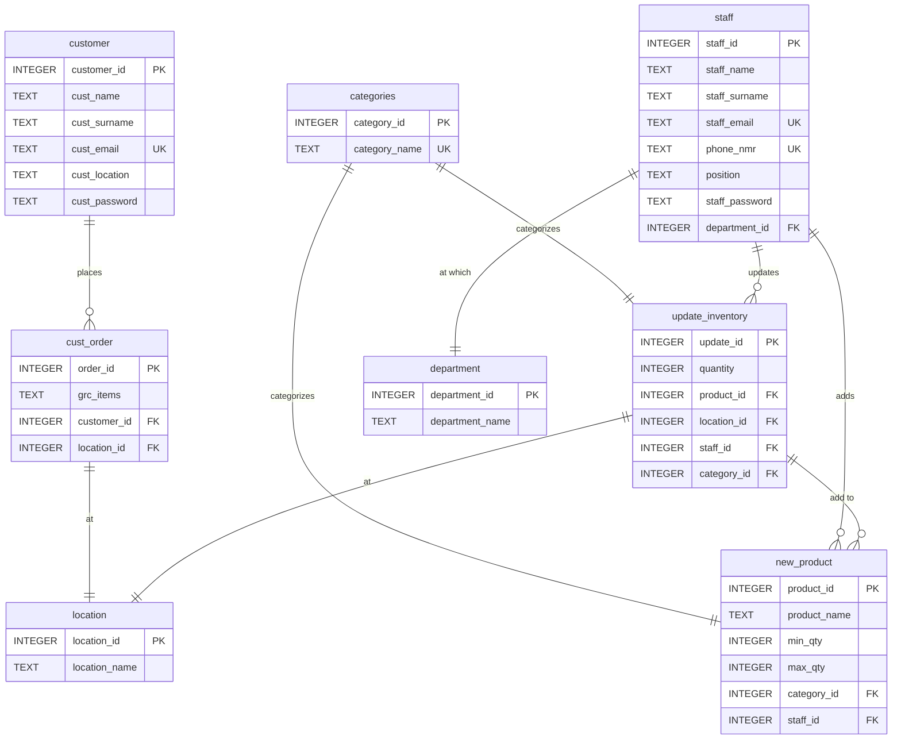

# BFB Group Project Final
 
## Members
- Louwhann Crous       u21518727  
Github username: u21518727
- Christiaan Conradie  u22601539   
Github username: CConradie2003
- Sebastian du Toit    u22500350   
Github username: Sebasdutoit
- Wandre Nel           u22494822   
Github username: Wandre05


A simple web-based STORE NAVIGATION FOR ENHANCED RETAIL SUPPLY
CHAIN EFFICIENCY system built with HTML, CSS, and SQL.
 
## Features

- **Home**: Overview of our system GrocerEase and indicate to sign in/up as customer or staff.
- **Customer Login**:This is a placeholder page to create an account to receive personalised recommendations and faster checkout.
- **Customer Registration**:This is a placeholder page for customer login. In a real application, this would include authentication mechanisms.
- **Customer Portal**:From here you can submit grocery items, view products and check order status.
- **Staff Verification**:This is a placeholder page for staff verification. In a real application, this would include authentication mechanisms.
- **Staff Dashboard**:Quick tools to manage inventory, process orders and help customers efficiently. This form is a simple placeholder for updating inventory items.
- **Inventory Overview**:Live counts and quick actions restock alerts highlight low stock automatically. With that we also included an automation so that pdf order sheet will be filled in automaticaly and sent the DC.
- **Add new Inventory**: Use the form to add a new product and the details of the product to the inventory.
- **Other**:-Contact-Privacy policy-Terms of service

## Database Setup

### Using SQLite  we created our Database

This is the file:
```bash
sqlite3 newdata.db < newdata.sql
   ```

## Database Schema

### Entity Relationship Diagram (ERD)



The database includes the following tables:

### Tables

1. **customer**: Registration and login information about customers who place orders.
2. **staff**: Registration and login of staff and their information to continue with updating inventory.
3. **location**: Indicates location of delivery/ pick-up of grocery items.
4. **department**: Stores information about company departments for the staff.
5. **categories**: Defines types of products. (Electronics, Clothing, Books, etc.)
6. **cust_order**: Showcases the location where customer orders products and the grocery items
7. **new_product**: Allow staff to add new type of product into the inventory system.
8. **update_inventory**: Tracks updates made to the inventory in levvels of quantity

### Views

1. **customer_orders**: View of order of products that the customer placed.
2. **inventory_overview**: Summary overview of the current inventory.

## Sample Data

The database includes sample data for testing:

- **11 Categories**: Meat,Poultry,Fish,Produce,Dairy,Bakery,Starch,Beverages,Cleaning Supplies,Electronics,Other
- **5 Departments**; Inventory Management,Sales,Customer Service,Logistics,Administration

## File Structure
```
├── Customer.html                # Customer portal/dashboard
├── Customer_login.html          # Customer login page
├── Customer_registration.html   # Customer registration form
├── Home.html                    # Home page
├── README.md                    # Project overview & instructions
├── Staff.html                   # Staff dashboard
├── Staff_registration.html      # Staff registration form
├── Verification.html            # Staff verification / login
├── contact.html                 # Contact page
├── newdata.sql                  # Database schema / sample data
├── newdata.db                   # db file creation from sql file
├── inventory.html               # Inventory management page
├── inventory_products.html      # Inventory products list
├── privacy-policy.html          # Privacy policy
├── styles.css                   # Global stylesheet
└── terms-of-service.html        # Terms of service
```
## Task Allocation

### Louwhann Crous (u21518727) — **Project Co-lead, Integration & Core DB (co-owner)**
**Primary**
- Project lead: repo conventions, folders, **uploaded most files/commits** thus commits is uneven spread before final exam project, branch/merge strategy.  
- **Core DB (with Wandre):** final schema sign-off, view logic design, sample data plan.  
- **ERD** (for SQLite) designed in MySQL Workbench **with help from Wandre**.  
- Customer Portal integration (`Customer.html`), site-wide navigation, final demo polish.

**Secondary**
- Frontend support on Customer flows; review Staff UX coherence.

**Files (Owner → Reviewer)**
- `Customer.html` → Reviewer: Sebastian  
- created ERD in `README.md` → Reviewer: Wandre  
- Co-owner: `newdata.sql` → Reviewer: Christiaan

**Report Role**
- **Editor/Overseer** — structure coherence, integration & commit history, ERD/DB section sign-off.

---

### Wandre Nel (u22494822) — **Core DB (co-lead) & Frontend Expansion + PDF Prototype**
**Primary**
- **Core DB (with Louwhann):** author `newdata.sql` (tables, views, inserts), **build scripts**, fix build errors.  
- Validate ERD ↔ schema; keep in sync.  
- Frontend expansion: inventory forms/tables, low-stock badges, responsive tweaks.
- **Order-sheet → PDF prototype** (static export) + README notes on how email to DC would work.  


**Secondary**
- Review Staff pages for data correctness; assist on ERD refinements.

**Files (Owner → Reviewer)**
- `newdata.sql`, build (`sqlite3 newdata.db < newdata.sql`) → Reviewer: Louwhann  
- Inventory UI tweaks → Reviewer: Sebastian  
- Co-owner: ERD → Reviewer: Christiaan

**Report Role**
- **Editor/Overseer** — DB correctness, terminology, low-stock logic explanation.

---

### Christiaan Conradie (u22601539) — **Staff & Ops  + Report Co-Author**
**Primary**
- Staff & Ops UI:
  - `Verification.html` (staff placeholder)
  - `Staff.html` (dashboard)
  - `inventory_overview` (page/section)
  - `inventory_products.html`
  - `inventory.html` (add/update form)  
- Reviewer for ERD deliverables.

**Secondary**
- Frontend polish with Sebastian (tables/forms, accessibility).

**Files (Owner → Reviewer)**
- `Verification.html` → Reviewer: Sebastian  
- `Staff.html` → Reviewer: Louwhann  
- `inventory_overview` → Reviewer: Wandre  
- `inventory_products.html` → Reviewer: Wandre  
- `inventory.html` → Reviewer: Sebastian  
- `/docs/order-sheet-sample.pdf` → Reviewer: Wandre

**Report Role**
- **Co-Author** — Staff & Ops, Order-sheet prototype, testing notes; contributes to Executive Summary & Intro.

---

### Sebastian du Toit (u22500350) — **Frontend Lead (Customer) + README Owner + Report Co-Author**
**Primary**
- Customer pages: `Home.html`, `Customer_login.html`, `Customer_registration.html`.  
- **Global styles:** `styles.css` (layout, forms, responsiveness, accessibility).  
- **README.md** author: overview, setup, screenshots, ERD link.

**Secondary**
- Frontend expansion with Christiaan/Wandre; polish & accessibility.  
- Review `Customer.html` and inventory forms for UI consistency.

**Files (Owner → Reviewer)**
- `Home.html`, `Customer_login.html`, `Customer_registration.html`, `styles.css`, `README.md` → Reviewer: Louwhann

**Report Role**
- **Co-Author** — Executive Summary, Customer UX, Frontend & Accessibility, Results/Future Work; README cross-links.

## Usage

1. Initialize the database using the SQL command line method above
2. Open `Home.html` in your web browser
3. Navigate through the different pages to see customer and staff views.

## Technologies Used

- **HTML5**: Structure and forms
- **Visual Studio**: Styling
- **MySQL Workbench**: Database for data persistence and ERD creation

## Browser Compatibility

The application works with all modern browsers that support HTML5 and CSS3, including:
- Chrome 90+
- Firefox 88+
- Safari 14+
- Edge 90+

