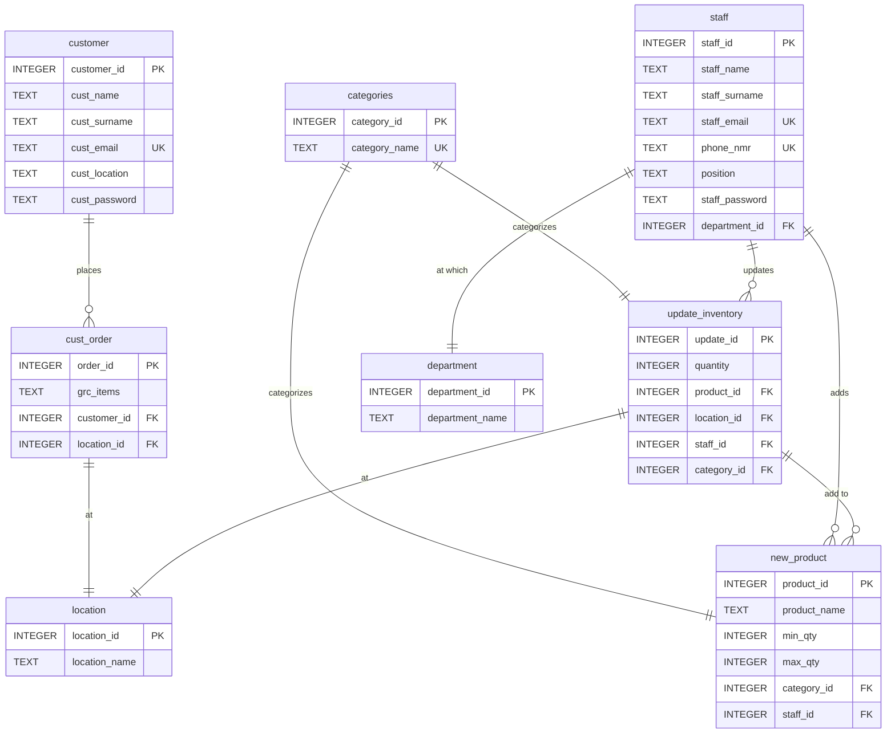

# BFB Group Project Final
 
## Members
- Louwhann Crous       u21518727
- Christiaan Conradie  u22601539
- Sebastian du Toit    u22500350
- Wandre Nel           u22494822

A simple web-based STORE NAVIGATION FOR ENHANCED RETAIL SUPPLY
CHAIN EFFICIENCY system built with HTML, CSS, and SQL.

## Features

- **Home**: Overview of our system GrocerEase and indicate to sign in/up as customer or staff.
- **Customer Login**:This is a placeholder page to create an account to receive personalised recommendations and faster checkout.
- **Customer Registration**:This is a placeholder page for customer login. In a real application, this would include authentication mechanisms.
- **Customer Portal**:From here you can submit grocery items, view products and check order status.
- **Staff Verification**:This is a placeholder page for staff verification. In a real application, this would include authentication mechanisms.
- **Staff Dashboard**:Quick tools to manage inventory, process orders and help customers efficiently. This form is a simple placeholder for updating inventory items.
- **Inventory Overview**:Live counts and quick actions restock alerts highlight low stock automatically.
- **Add new Inventory**: Use the form to add a new product and the details of the product to the inventory.
- **Other**:-Contact-Privacy policy-Terms of service

## Database Setup

### Using SQLite Command Line

1. Open command prompt/terminal in the project directory
2. Run the SQL commands:
   ```bash
   sql data.db < data.sql
   ```

## Database Schema

### Entity Relationship Diagram (ERD)



The database includes the following tables:

### Tables

1. **customer**: Registration and login information about customers who place orders.
2. **staff**: Registration and login of staff and their information to continue with updating inventory.
3. **location**: Indicates location of delivery/ pick-up of grocery items.
4. **department**: Stores information about company departments for the staff.
5. **categories**: Defines types of products. (Electronics, Clothing, Books, etc.)
6. **cust_order**: Showcases the location where customer orders products and the grocery items
7. **new_product**: Allow staff to add new type of product into the inventory system.
8. **update_inventory**: Tracks updates made to the inventory in levvels of quantity

### Views

1. **customer_orders**: View of order of products that the customer placed.
2. **inventory_overview**: Summary overview of the current inventory.

## Sample Data

The database includes sample data for testing:

- **9 Categories**: Electronics, Clothing, Books, Food & Beverages, Tools & Hardware, Furniture, Beauty & Health, Sports & Outdoors, Other
- **1 Vendor**: John Doe (TechStore Solutions)
- **10 Products**: Various items across different categories with realistic pricing and quantities
- **8 Stock Updates**: Sample transaction history

## File Structure
```
├── Customer.html                # Customer portal/dashboard
├── Customer_login.html          # Customer login page
├── Customer_registration.html   # Customer registration form
├── Home.html                    # Home page
├── README.md                    # Project overview & instructions
├── Staff.html                   # Staff dashboard
├── Staff_registration.html      # Staff registration form
├── Verification.html            # Staff verification / login
├── contact.html                 # Contact page
├── data.sql                     # Database schema / sample data
├── inventory.html               # Inventory management page
├── inventory_products.html      # Inventory products list
├── privacy-policy.html          # Privacy policy
├── styles.css                   # Global stylesheet
└── terms-of-service.html        # Terms of service
```

## Usage

1. Initialize the database using the SQL command line method above
2. Open `Home.html` in your web browser
3. Navigate through the different pages to see customer and staff views.

## Technologies Used

- **HTML5**: Structure and forms
- **Visual Studio**: Styling
- **MySQL Workbench**: Database for data persistence and ERD creation

## Browser Compatibility

The application works with all modern browsers that support HTML5 and CSS3, including:
- Chrome 90+
- Firefox 88+
- Safari 14+
- Edge 90+

