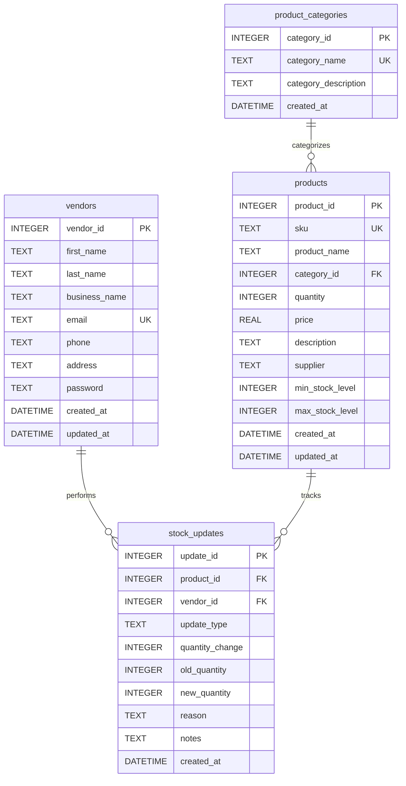

# BFB Group Project Final

A simple web-based inventory management system built with HTML, Bootstrap, and SQLite.

## Features

- **Dashboard**: Overview of inventory statistics and recent activity
- **Product Management**: Add, view, and update product information
- **Stock Tracking**: Update stock levels with detailed history
- **Vendor Management**: Login and registration system for vendors
- **Category Management**: Organize products by categories

## Database Setup

### Using SQLite Command Line

1. Open command prompt/terminal in the project directory
2. Run the SQL commands:
   ```bash
   sqlite3 inventory.db < inventory.sql
   ```

## Database Schema

### Entity Relationship Diagram (ERD)



The database includes the following tables:

### Tables

1. **product_categories**: Product categories (Electronics, Clothing, Books, etc.)
2. **vendors**: Registered vendors and their business information
3. **products**: Product inventory with SKU, name, quantity, price, etc.
4. **stock_updates**: History of all stock level changes

### Views

1. **low_stock_products**: View of products with low stock alerts
2. **inventory_summary**: Summary statistics for the dashboard

## Sample Data

The database includes sample data for testing:

- **9 Categories**: Electronics, Clothing, Books, Food & Beverages, Tools & Hardware, Furniture, Beauty & Health, Sports & Outdoors, Other
- **1 Vendor**: John Doe (TechStore Solutions)
- **10 Products**: Various items across different categories with realistic pricing and quantities
- **8 Stock Updates**: Sample transaction history

## File Structure

```
├── index.html              # Main dashboard
├── login.html              # Vendor login page
├── register.html           # Vendor registration page
├── add-product.html        # Add new products
├── view-inventory.html     # View all inventory
├── update-stock.html       # Update stock levels
├── inventory.sql           # Database schema and sample data
├── inventory.db            # SQLite database (created after running setup)
└── readme.md              # This file
```

## Usage

1. Initialize the database using the SQLite command line method above
2. Open `index.html` in your web browser
3. Navigate through the different pages to manage your inventory

## Technologies Used

- **HTML5**: Structure and forms
- **Bootstrap 5.3.8**: UI framework and styling
- **Bootstrap Icons**: Icon set
- **SQLite**: Database for data persistence

## Browser Compatibility

The application works with all modern browsers that support HTML5 and CSS3, including:
- Chrome 90+
- Firefox 88+
- Safari 14+
- Edge 90+

Note: This is a static HTML application. For production use, you would need to add backend functionality for database connectivity and form processing.
